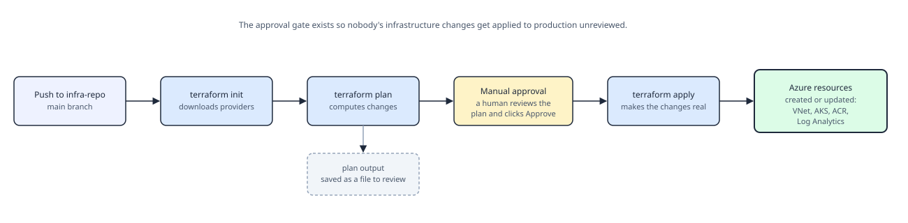

# On-Prem to AKS Migration: A Beginner's End-to-End DevOps Playbook

*Prepared 2026-09-16*

## 1. Welcome — What This Project Is and Who It's For

This playbook is written for **X** — someone who has never touched a cloud portal, a terminal, Kubernetes, Terraform, or a pipeline before, and who has just been handed their very first real DevOps project.

### The scenario

A company has an application that has always run **on-premises** — on physical or virtual servers sitting in a data center the company owns or rents space in. "On-prem" just means "not in the cloud." The company has decided to **migrate** (move) this application to **Azure Kubernetes Service (AKS)**, Microsoft Azure's managed platform for running containerized applications. Once it's running there, X will also be responsible for **monitoring it** (watching whether it's healthy) and **supporting it** (fixing things when they break, scaling it when traffic grows).

To practice this end to end, we'll use a small stand-in application — a Java "Hello World" web app — instead of the company's real, larger application. The steps are exactly the same regardless of the app's size; a bigger app just means a bigger Docker image and more configuration, not a different process.

### This is a from-scratch, greenfield build

Nothing exists yet. There is no cloud account configured for this project, no Kubernetes cluster, no pipeline, no automation. X is not being handed a half-finished setup — X is building **everything**, in this order:

1. A place to store the code (source control on GitHub)
2. A way to turn the app into a container image (Docker)
3. A way to create the cloud infrastructure itself, repeatably and automatically, instead of clicking around the Azure Portal by hand (Terraform, run by its own pipeline)
4. A way to automatically build, test, and ship the application into that infrastructure every time the code changes (a second, separate pipeline — CI/CD)
5. A way to see what's happening once it's live, and to keep it running (monitoring and operations)

Notice that step 3 (building the infrastructure) and step 4 (shipping the application) are **two separate pipelines** with two separate jobs. This trips up a lot of beginners, so it's worth saying plainly up front: **the infrastructure pipeline builds the "empty building" (the cluster, the network, the registry). The application pipeline moves the "furniture" (your code) into that building.** They run on different schedules, are triggered by different events, and usually live in different repositories. Section 3 (Strategy) explains why.

### How to use this document

Each numbered section below is a step. They are ordered the way you'd actually do the work — read and follow them top to bottom the first time through. Every command shown is a **literal command** you can type into a terminal; nothing is left implied. Terms that might be unfamiliar are explained the first time they appear, and are also collected in the Glossary near the end. If you only remember one thing from this whole document, remember this: **infrastructure and application deployment are two different concerns, automated by two different pipelines, and that separation is the whole strategy.**

## 2. Target Architecture — The Big Picture

Before touching a keyboard, it helps to see where every piece we're about to build actually sits, and how they connect. Here is the complete picture we're working towards:


Reading it left to right:

- **Developer → GitHub**: X writes code on a laptop and pushes it to GitHub, which is just a hosted, shared copy of the project's history that everyone (and every pipeline) can read from.
- **GitHub → Azure DevOps Pipelines**: GitHub doesn't run our automation itself. Azure DevOps watches the repo and reacts when code changes, running one of two pipelines depending on what changed.
- **Infra Pipeline → Azure Resource Group**: this pipeline's only job is to run Terraform, which reads text files describing "what infrastructure should exist" and creates or updates real Azure resources to match: a virtual network (VNet), the AKS cluster itself, a Container Registry (ACR) to store Docker images, and a Log Analytics workspace to collect logs and metrics.
- **App CI/CD Pipeline → ACR → AKS**: this pipeline's job is to take the application's source code, build it, package it as a Docker image, push that image into ACR, and then tell AKS to run it.
- **AKS → ACR (dashed line)**: this arrow runs the opposite direction from the push. When Kubernetes actually starts a pod, the AKS nodes themselves pull the image out of ACR — the pipeline doesn't hand the image to AKS directly, it just tells AKS which image (by name and tag) to go fetch.
- **AKS → Log Analytics (dashed line)**: while running, the cluster continuously ships logs and metrics out to Log Analytics, which is what lets X (or anyone on support) see what's happening without having to log into a server directly.
- **AKS → Load Balancer → End User**: Kubernetes doesn't expose your app to the internet by itself. A Load Balancer (created automatically by Kubernetes when we ask for one) gets a public IP address and forwards incoming web traffic to whichever pods are currently healthy.

Two things worth noticing about this diagram before we start building:

1. **There are two independent pipelines**, not one giant pipeline that does everything. This is deliberate — infrastructure changes (rare, risky, needs careful review) and application deployments (frequent, routine) have very different rhythms and risk levels, so we automate and gate them separately.
2. **Terraform never touches the application code, and the app pipeline never creates infrastructure.** Terraform's whole world is "what Azure resources exist." The app pipeline's whole world is "what code is running inside resources that already exist." Keeping this boundary crisp is what makes both pipelines simple, safe, and easy to reason about.

## 3. Overall Strategy — What We Build, and in What Order

A beginner's biggest risk on a project like this isn't any single tool — it's building things in the wrong order and getting stuck. Here is the order we'll follow, and why.

### Why infrastructure comes before the application

You cannot deploy an application into a Kubernetes cluster that doesn't exist yet, and you cannot push a Docker image into a container registry that doesn't exist yet. So the infrastructure has to exist **first**, one time, before the application pipeline can do anything useful. After that first build, infrastructure changes become rare ("add a second node pool," "increase disk size") while application deployments happen constantly (every code change). That's the second reason to keep them as separate pipelines: they change at completely different frequencies.

### Two repositories, two pipelines

We will use **two GitHub repositories**:

- **`infra-repo`** — contains only Terraform files. Describes the Azure resource group, VNet, AKS cluster, ACR, and Log Analytics workspace. Has its own Azure DevOps pipeline (the **infra pipeline**) that runs `terraform plan` and `terraform apply`.
- **`app-repo`** — contains only the Java application's source code, Dockerfile, and Kubernetes manifests (the plain YAML files that describe how the app should run). Has its own Azure DevOps pipeline (the **app CI/CD pipeline**) that builds, tests, containerizes, and deploys the app.

Some teams keep both in one repository with two pipeline files instead of two repositories — that also works. What matters is that the two **pipelines** stay separate and are triggered independently, not that the repos are physically apart. This document uses two repos because it makes the boundary obvious for a first project, and because it means an application deploy can never accidentally trigger an infrastructure change.

### Environment strategy: start with one, grow into three

Real companies typically run three copies of their environment: **dev** (for trying things, breaking things safely), **staging/UAT** (a rehearsal of production), and **production** (what real users touch). For a first project, build and prove out **one environment** end to end — call it `dev` or `prod`, it doesn't matter yet — before you try to multiply it. Once the single environment works, adding a second is mostly a matter of: a second Terraform "workspace" or variable file, a second AKS namespace or cluster, and a copy of the pipeline pointed at different variable values. Trying to build all three environments simultaneously on your very first attempt is how beginners get stuck for weeks; this document builds exactly one.

### The order of operations, precisely

1. Set up GitHub and learn the minimum Git commands needed to get code into a repo (Section 5).
2. Containerize the sample application with Docker and prove the image runs locally (Section 6).
3. Write the Terraform files describing the Azure infrastructure (Section 7).
4. Build the infra pipeline in Azure DevOps and run it once to actually create that infrastructure (Section 8).
5. Build the app CI/CD pipeline and run it to build, push, and deploy the application into the infrastructure that now exists (Section 9).
6. Wire up secrets, networking, monitoring, security, and cost controls around what's now running (Sections 10–15).

Each later section assumes the ones before it are done — this is meant to be followed in order on the first pass.

## 4. Prerequisites — Accounts and Tools

### Accounts (create these in a browser, no install needed)

| Account | What it's for | Where |
|---|---|---|
| **GitHub account** | Hosts your source code (both repos) | github.com — free tier is enough |
| **Azure subscription** | The actual cloud account that gets billed and holds every resource we create | portal.azure.com — a free trial includes credit, enough for this project |
| **Azure DevOps organization** | Hosts the two pipelines. Separate product from the Azure Portal, but same Microsoft login | dev.azure.com — free for small projects |

### Tools to install on your own laptop

Every tool below is a program you install once. "Installing" a command-line tool means: after installation, typing its name into a terminal runs it. If you've never used a terminal before, Section 5 explains what that even is before you need it for real — for now, just get everything installed.

| Tool | What it actually does | Why we need it | How to check it's installed |
|---|---|---|---|
| **Git** | Tracks every change to your code over time and talks to GitHub | Without it you cannot get code onto GitHub, or pull it back down | `git --version` |
| **Azure CLI (`az`)** | A command-line tool for controlling Azure resources (as an alternative to clicking in the web portal) | The pipelines and your terminal use it to log in to Azure and inspect resources | `az --version` |
| **Terraform** | Reads `.tf` files describing infrastructure and creates/updates/destroys real Azure resources to match | This is the tool that actually builds the cloud infrastructure | `terraform -version` |
| **Docker** | Builds container images from a `Dockerfile` and can run them locally | Lets you build and test the exact same image the pipeline will later build, before pushing anywhere | `docker --version` |
| **kubectl** | The command-line tool for talking to a Kubernetes cluster — asking what's running, viewing logs, etc. | Used to inspect and troubleshoot the AKS cluster once it exists | `kubectl version --client` |
| **A code editor** (e.g. Visual Studio Code) | Where you'll actually write and read all the files in this project | Any text editor works; VS Code is free and has helpful extensions for Terraform, YAML, and Docker | — |

Install links (official sources only): Git — git-scm.com/downloads; Azure CLI — learn.microsoft.com (search "install Azure CLI"); Terraform — terraform.io/downloads; Docker Desktop — docker.com/products/docker-desktop; kubectl — kubernetes.io/docs/tasks/tools; VS Code — code.visualstudio.com.

After installing, open a terminal (Section 5 shows how) and run all six version-check commands above. If a command says "not recognized" or "command not found," that tool either failed to install or wasn't added to your system's PATH (the list of folders the terminal searches for programs) — re-run its installer and make sure any "Add to PATH" checkbox is ticked.

## 5. Source Control Setup — Terminal and Git From Zero

This section assumes you have genuinely never typed a command into a computer before. Every command is spelled out exactly as you'd type it.

### What a terminal actually is

A terminal (also called a "command line," "shell," or "console") is a text-only window where, instead of clicking icons, you type the name of a program and press Enter to run it. That's the entire concept. Everything else is just learning which words to type.

- **Windows**: open the Start menu, type `PowerShell`, and open "Windows PowerShell."
- **Mac**: open Spotlight (Cmd+Space), type `Terminal`, press Enter.
- **Linux**: almost every desktop has a "Terminal" application in its app menu; the keyboard shortcut is usually Ctrl+Alt+T.

A few commands work everywhere and are worth knowing immediately:

| Command | What it does |
|---|---|
| `pwd` (Mac/Linux, also works in PowerShell) | Prints the folder you're currently "in" |
| `ls` (Mac/Linux, also works in PowerShell) or `dir` (Windows) | Lists the files and folders in your current folder |
| `cd foldername` | Moves ("changes directory") into `foldername` |
| `cd ..` | Moves up one folder, out of the current one |
| `mkdir foldername` | Creates a new folder named `foldername` |

Everything from here on is typed into this same terminal window.

### Installing and configuring Git

After installing Git (Section 4's link), tell it who you are — this name and email get attached to every change you save, so your teammates (and future you) know who did what:

```
git config --global user.name "Your Name"
git config --global user.email "you@example.com"
```

`--global` means "use this for every project on this computer," not just one.

### The core idea behind Git

Git takes snapshots of your project's files over time, called **commits**. You decide when to take a snapshot (you don't get one automatically every time you save a file). A **repository** ("repo") is a project folder that Git is tracking. GitHub is simply a website that stores a copy of a repository so it can be shared, backed up, and read by pipelines.

### Creating your two repositories on GitHub

1. Log into github.com, click the **+** icon top-right, choose **New repository**.
2. Name it `infra-repo`. Leave it empty (don't add a README yet). Click **Create repository**.
3. Repeat, naming the second one `app-repo`.

GitHub will show you a page with commands under "…or push an existing repository from the command line" — that's exactly what we're about to do by hand, explained.

### Getting an existing project folder onto GitHub, step by step

Using `app-repo` as the example (repeat the same steps later for `infra-repo`):

```
cd path/to/your/app-project-folder
git init
```

`git init` turns the current folder into a Git repository — it creates a hidden `.git` subfolder where all the history will live. Nothing is saved yet; this just turns tracking "on."

```
git status
```

`git status` is the command you will run constantly. It tells you what's changed, what's staged, and what branch you're on. Right now it will show all your files as "untracked."

```
git add .
```

`git add` stages files — it marks them as "include this in the next snapshot." The `.` means "everything in this folder and its subfolders." You can also `git add filename.txt` to stage just one file.

```
git commit -m "Initial commit"
```

`git commit` actually takes the snapshot of everything staged. `-m "message"` attaches a short description — every commit requires one; write what you did and, if it's not obvious, why.

Now connect this local repo to the empty one you created on GitHub:

```
git remote add origin https://github.com/<your-username>/app-repo.git
```

A "remote" is Git's name for a copy of the repo that lives somewhere else. `origin` is just the conventional nickname for "the main remote copy" — you could call it anything, but everyone calls it `origin`.

```
git branch -M main
git push -u origin main
```

A **branch** is an independent line of history — `main` is the conventional name for the primary one. `git push` uploads your commits to GitHub; `-u origin main` (only needed the first time) tells Git "remember that my local `main` branch should push to and pull from `origin`'s `main` branch," so future pushes can just be `git push`.

The first time you push, GitHub will ask you to authenticate. GitHub no longer accepts your account password here — you'll need either:

- A **Personal Access Token (PAT)**: GitHub → Settings → Developer settings → Personal access tokens → Generate new token. Use this token as the "password" when Git prompts for one.
- An **SSH key**: a more permanent setup (search GitHub's docs for "Generating a new SSH key") — recommended once you're doing this daily, but a PAT is fine to start.

### The everyday loop

Once set up, this is the cycle you repeat for the rest of the project, every time you change a file:

```
git status                    # see what changed
git add .                     # stage the changes
git commit -m "Describe it"   # snapshot them
git push                      # upload to GitHub
```

Two more commands you'll need soon:

```
git pull                      # download and merge changes from GitHub into your local folder
git checkout -b feature-name  # create AND switch to a new branch called feature-name
```

Use a new branch (via `git checkout -b`) whenever you want to try something without touching `main` — push that branch, open a **Pull Request** on GitHub (a request to merge your branch into `main`, which is also where teammates review your changes), and merge it once it looks right.

### Folder structure

Inside `infra-repo`, you'll eventually have Terraform files at the root (Section 7 builds these) plus an `azure-pipelines.yml` for the infra pipeline. Inside `app-repo`, keep the Java source, `Dockerfile`, a `k8s/` folder for Kubernetes manifests, and its own `azure-pipelines.yml` for the app pipeline — mirroring exactly the `hello-world` project structure already sitting in this workspace.

## 6. Containerizing the Application With Docker

### Why containers at all

"It works on my machine" is the classic problem containers solve. A **container** packages your application together with everything it needs to run (the Java runtime, libraries, OS-level files) into one bundle that behaves identically on your laptop, in the pipeline, and inside AKS. Kubernetes (which AKS runs) manages containers, not raw application files — so this step is not optional, it's the format Kubernetes speaks.

### The Dockerfile

A `Dockerfile` is a plain text recipe: a list of steps Docker follows to build an **image** (a frozen, runnable snapshot of your app and its dependencies). A **container** is a running instance of an image — the same relationship as a class and an object, or a recipe and a baked cake. The `app-repo` in this workspace already has one, using a **multi-stage build**: one stage compiles the Java code with Maven, and a second, much smaller stage copies out just the finished program to actually run — keeping the final image small since it doesn't need to also carry the compiler and build tools.

### Building and running the image yourself

From inside the `app-repo` folder in your terminal:

```
docker build -t hello-world:local .
```

- `docker build` reads the `Dockerfile` in the current folder and builds an image from it.
- `-t hello-world:local` **tags** (names) the image `hello-world` with version label `local`, so you can refer to it later.
- The trailing `.` means "use the current folder as the build context" — the set of files Docker is allowed to read while building.

```
docker run -p 8080:8080 hello-world:local
```

- `docker run` starts a container from that image.
- `-p 8080:8080` **publishes** a port: the first `8080` is the port on your laptop, the second is the port the app listens on inside the container. Without this flag you couldn't reach the app from your browser at all.

Open a browser to `http://localhost:8080` — you should see the Hello World response. This proves the image is correct **before** any pipeline or cloud infrastructure is involved, which makes it much easier to tell later whether a problem is your code or your cloud setup.

Stop the container with Ctrl+C in that terminal, or in a second terminal run `docker ps` (lists running containers) followed by `docker stop <container-id>`.

### Where the image goes next

Right now the image only exists on your laptop. Section 9 (the app CI/CD pipeline) will repeat this exact `docker build` step on Azure DevOps's servers instead of your laptop, then run `docker push` to upload the resulting image into ACR (Section 7 creates ACR) — that's what makes the image available for AKS to run.

## 7. Provisioning Azure Infrastructure With Terraform

### Why not just click around in the Azure Portal?

You could create every resource by hand in the Azure Portal's web UI. The problem: nobody can review it (there's no diff to look at), nobody can reliably repeat it for a second environment, and there's no record of who changed what setting six months from now. **Terraform** fixes this by describing your infrastructure as text files ("Infrastructure as Code"). You write what you want to exist; Terraform figures out how to create, change, or delete real Azure resources to match. The text files live in Git, so every change to infrastructure goes through the same review process as application code.

### Terraform state, in plain terms

Every time Terraform runs, it needs to know what it created last time, so it can compute the difference between "what exists" and "what the files now say should exist." It stores this knowledge in a **state file**. If two people (or a pipeline and a person) run Terraform against the same infrastructure using two different, disconnected state files, they will conflict and corrupt each other's understanding of reality. The fix is a **remote backend**: one shared state file, stored in Azure Blob Storage, that everyone and every pipeline run reads from and writes to. We create this storage account **manually, once, by hand** — it's the one piece of infrastructure that can't bootstrap itself, since Terraform needs somewhere to put its state before it can manage anything else.

```
az group create --name rg-terraform-state --location eastus
az storage account create --name sttfstatehelloworld --resource-group rg-terraform-state --sku Standard_LRS
az storage container create --name tfstate --account-name sttfstatehelloworld
```

(`az` commands like these require `az login` first, which opens a browser to sign into your Azure subscription.)

### The Terraform files, resource by resource

Inside `infra-repo`, these files describe everything from the architecture diagram in Section 2. Real projects split these across multiple `.tf` files by convention (Terraform reads every `.tf` file in a folder as one combined configuration) — shown here as one block per concept:

**`backend.tf`** — tells Terraform where to store the state file created above:
```
terraform {
  backend "azurerm" {
    resource_group_name  = "rg-terraform-state"
    storage_account_name = "sttfstatehelloworld"
    container_name        = "tfstate"
    key                    = "helloworld.tfstate"
  }
}
```

**`providers.tf`** — tells Terraform which cloud it's talking to (a "provider" is a plugin Terraform downloads during `terraform init`):
```
terraform {
  required_providers {
    azurerm = {
      source  = "hashicorp/azurerm"
      version = "~> 3.0"
    }
  }
}

provider "azurerm" {
  features {}
}
```

**`main.tf`** — the actual resources, matching every box in the Section 2 diagram:
```
resource "azurerm_resource_group" "main" {
  name     = "rg-helloworld-prod"
  location = "eastus"
}

resource "azurerm_virtual_network" "main" {
  name                = "vnet-helloworld"
  address_space       = ["10.0.0.0/16"]
  location            = azurerm_resource_group.main.location
  resource_group_name = azurerm_resource_group.main.name
}

resource "azurerm_subnet" "aks" {
  name                 = "snet-aks"
  resource_group_name  = azurerm_resource_group.main.name
  virtual_network_name = azurerm_virtual_network.main.name
  address_prefixes     = ["10.0.1.0/24"]
}

resource "azurerm_container_registry" "main" {
  name                = "acrhelloworldprod"
  resource_group_name = azurerm_resource_group.main.name
  location            = azurerm_resource_group.main.location
  sku                 = "Standard"
  admin_enabled       = false
}

resource "azurerm_log_analytics_workspace" "main" {
  name                = "log-helloworld-prod"
  resource_group_name = azurerm_resource_group.main.name
  location            = azurerm_resource_group.main.location
  sku                 = "PerGB2018"
  retention_in_days   = 30
}

resource "azurerm_kubernetes_cluster" "main" {
  name                = "aks-helloworld-prod"
  resource_group_name = azurerm_resource_group.main.name
  location            = azurerm_resource_group.main.location
  dns_prefix          = "helloworld"

  default_node_pool {
    name           = "default"
    node_count     = 2
    vm_size        = "Standard_D2s_v3"
    vnet_subnet_id = azurerm_subnet.aks.id
  }

  identity {
    type = "SystemAssigned"
  }

  oms_agent {
    log_analytics_workspace_id = azurerm_log_analytics_workspace.main.id
  }
}

resource "azurerm_role_assignment" "aks_acr_pull" {
  scope                = azurerm_container_registry.main.id
  role_definition_name = "AcrPull"
  principal_id          = azurerm_kubernetes_cluster.main.kubelet_identity[0].object_id
}
```

A few things worth understanding, not just copying:

- Writing `azurerm_resource_group.main.location` inside the VNet block instead of retyping `"eastus"` is not just laziness — it means every resource automatically follows the resource group if you ever change its region in one place.
- The `azurerm_role_assignment` at the end is easy to skip and then wonder why pods can never pull images: it explicitly grants the AKS cluster's own identity permission to pull from ACR. Without it, the dashed "image pull" arrow in the Section 2 diagram fails with a permissions error.
- `oms_agent` is what wires the cluster up to send logs and metrics to the Log Analytics workspace — this is the "AKS → Log Analytics" arrow from the diagram, configured at creation time rather than added later.

**`variables.tf`** and **`outputs.tf`** — as this grows, pull hardcoded values (region, names, node count) into variables so the same files can be reused for a second environment later, and output values other tools need, e.g.:
```
output "aks_cluster_name" {
  value = azurerm_kubernetes_cluster.main.name
}

output "acr_login_server" {
  value = azurerm_container_registry.main.login_server
}
```

### Running Terraform yourself, once, before automating it

Just like Section 6's local Docker build, run this by hand first so you understand exactly what it does before a pipeline does it unattended:

```
terraform init
```
Downloads the `azurerm` provider plugin and connects to the remote state backend. Safe to re-run any time; it only sets up tooling, it doesn't touch Azure resources.

```
terraform plan
```
Compares the `.tf` files against the current state and prints exactly what it would create, change, or destroy — **without doing it**. Read this output every single time; it's your one chance to catch a mistake (like a typo that would delete the wrong resource) before it's real.

```
terraform apply
```
Runs the same comparison again and then, after you type `yes` to confirm, actually creates/changes the resources in Azure. The first `apply` for this project will take several minutes, mostly waiting for AKS to finish provisioning.

```
terraform destroy
```
The reverse — deletes everything Terraform created. Extremely useful for a learning project (tear it down when you're not using it, to avoid Azure charges) and extremely dangerous on real infrastructure — always read its plan output as carefully as `apply`'s.

## 8. The Infrastructure Pipeline (Azure DevOps)

Running `terraform apply` from your own laptop (Section 7) is fine for learning, but it means infrastructure changes depend on one person's machine having the right credentials and remembering the right commands. The infra pipeline automates the exact same commands so they run consistently, get logged, and — critically — get a mandatory human review before anything changes in production.



### Setting this up in Azure DevOps (one-time, in the web UI)

1. In your Azure DevOps organization, create a **Project**, then connect it to your `infra-repo` on GitHub (Project Settings → Service connections → GitHub, or link it directly when creating the pipeline).
2. Create an **Azure Resource Manager service connection** (Project Settings → Service connections → New → Azure Resource Manager) — this is how the pipeline authenticates to your Azure subscription without you pasting a password into a YAML file.
3. Create an **Environment** named `production` (Pipelines → Environments → New Environment), then add an **Approval check** to it (click into the environment → Approvals and checks → Approvals — add yourself, or a teammate, as a required approver).

### The pipeline file (`infra-repo/azure-pipelines.yml`)

```yaml
trigger:
  branches:
    include:
      - main

pool:
  vmImage: 'ubuntu-latest'

variables:
  - group: terraform-backend-config   # storage account/container names from Section 7

stages:
  - stage: Validate
    displayName: 'terraform init + plan'
    jobs:
      - job: Plan
        steps:
          - task: TerraformInstaller@1
            inputs:
              terraformVersion: 'latest'
          - task: TerraformTaskV4@4
            displayName: 'terraform init'
            inputs:
              provider: 'azurerm'
              command: 'init'
              backendServiceArm: 'azure-subscription-connection'
              backendAzureRmResourceGroupName: 'rg-terraform-state'
              backendAzureRmStorageAccountName: 'sttfstatehelloworld'
              backendAzureRmContainerName: 'tfstate'
              backendAzureRmKey: 'helloworld.tfstate'
          - task: TerraformTaskV4@4
            displayName: 'terraform plan'
            inputs:
              provider: 'azurerm'
              command: 'plan'
              environmentServiceNameAzureRM: 'azure-subscription-connection'

  - stage: Apply
    displayName: 'terraform apply (after approval)'
    dependsOn: Validate
    jobs:
      - deployment: ApplyInfra
        environment: 'production'   # this is what makes the approval gate happen
        pool:
          vmImage: 'ubuntu-latest'
        strategy:
          runOnce:
            deploy:
              steps:
                - task: TerraformInstaller@1
                  inputs:
                    terraformVersion: 'latest'
                - task: TerraformTaskV4@4
                  displayName: 'terraform init'
                  inputs:
                    provider: 'azurerm'
                    command: 'init'
                    backendServiceArm: 'azure-subscription-connection'
                    backendAzureRmResourceGroupName: 'rg-terraform-state'
                    backendAzureRmStorageAccountName: 'sttfstatehelloworld'
                    backendAzureRmContainerName: 'tfstate'
                    backendAzureRmKey: 'helloworld.tfstate'
                - task: TerraformTaskV4@4
                  displayName: 'terraform apply'
                  inputs:
                    provider: 'azurerm'
                    command: 'apply'
                    environmentServiceNameAzureRM: 'azure-subscription-connection'
```

Notice this mirrors exactly the by-hand steps from Section 7 (`init`, `plan`, `apply`) — a pipeline is nothing mysterious, it's just those same commands, run on a shared machine, in a fixed order, with a human checkpoint added between `plan` and `apply` via the `production` Environment. The `Apply` stage only runs after `Validate` succeeds (`dependsOn: Validate`) and after whoever you designated as an approver clicks Approve on the run in the Azure DevOps UI — exactly the gate shown in the diagram above.

Commit this file to `infra-repo`, push it (using the Git commands from Section 5), then create the pipeline itself in Azure DevOps: Pipelines → New Pipeline → point it at `infra-repo` → it will detect this `azure-pipelines.yml` automatically. Run it once, watch the plan output carefully, approve it, and you should see the resources from Section 7 appear in the Azure Portal.

## 9. The Application CI/CD Pipeline (Azure DevOps)

With the infrastructure from Sections 7–8 now actually running in Azure, this pipeline handles the application side: every time code changes in `app-repo`, automatically compile it, test it, package it, and get it running on the AKS cluster that already exists.


This is exactly the `azure-pipelines.yml` already built earlier in this workspace for the `hello-world` app — it's worth re-reading now with the full picture in mind, since every piece of it maps directly onto this diagram:

- **Stage 1 (Build & Test)** runs `mvn clean verify`, matching the Docker multi-stage build's first stage from Section 6 — compiling the code and running automated tests, on every push and pull request, before anything is packaged.
- **Stage 2 (Build & Push Image)** only runs on a direct push to `main` (not on pull requests — we don't want to publish an image for code that hasn't been reviewed yet). It repeats the `docker build` from Section 6, then `docker push`es the result into the ACR that Terraform created in Section 7. Each image is tagged with the Git commit hash, so every running version can be traced back to the exact code that produced it.
- **Stage 3 (Deploy to AKS)** uses the `KubernetesManifest@1` task to apply the `k8s/deployment.yaml` and `k8s/service.yaml` files (also already in this workspace) to the AKS cluster, substituting in the image that Stage 2 just pushed. Kubernetes then performs a **rolling update**: new pods with the new image are started, and only once they pass their readiness probe are the old pods removed — so the app never goes fully offline during a deploy.

### One-time setup this pipeline needs in Azure DevOps

Just like Section 8, but pointed at the application's resources instead of the resource group itself:

1. A **Docker Registry service connection** (Project Settings → Service connections → New → Docker Registry → Azure Container Registry) named to match `dockerRegistryServiceConnection` in the pipeline — this is what lets Azure DevOps push into the ACR that Terraform created.
2. The same **Azure Resource Manager service connection** from Section 8 can be reused for the `KubernetesManifest@1` task's `azureSubscriptionConnection`, since it also just needs permission to reach the AKS cluster.
3. A **Variable Group** (Pipelines → Library) holding `acrName`, `aksResourceGroup`, and `aksClusterName` — the real values Terraform's `outputs.tf` (Section 7) printed after `apply` finished.
4. Reuse (or create) the `production` **Environment** from Section 8 if you want a manual approval before deploying application changes too — common for a first project even though application deploys are usually lower-risk than infrastructure ones.

Once this is wired up, create the pipeline (Pipelines → New Pipeline → point it at `app-repo`) the same way as Section 8. From now on, every `git push` to `app-repo`'s `main` branch (using the everyday Git loop from Section 5) automatically flows all the way through to a running update on AKS — which is the entire point of this project.

## 10. Managing Secrets and Credentials

### The rule

Never type a password, key, token, or connection string directly into a `.tf` file, a `.yml` pipeline file, or any file that gets committed to Git. Once something is committed, it exists in that repo's history forever, even if you delete it in a later commit — anyone with read access to the repo (and, if the repo is ever made public by accident, literally anyone) can dig it out. Every secret in this project goes through one of the mechanisms below instead.

### Service connections

Used throughout Sections 8–9. A **service connection** is a credential Azure DevOps stores encrypted, referenced in pipeline YAML only by name (e.g. `azure-subscription-connection`). The pipeline never sees or prints the actual secret — the service connection framework injects the real credential only at the moment a task like `TerraformTaskV4@4` or `KubernetesManifest@1` runs.

### Variable groups

Used for non-secret-but-environment-specific values like `acrName` or `aksClusterName` (Pipelines → Library → Variable groups). You can also mark individual variables inside a group as **secret** (a lock icon in the UI) — once locked, its value is masked in pipeline logs (shown as `***`) even if a script accidentally tries to print it.

### Azure Key Vault

For anything more sensitive than the above — a database password, a third-party API key — store it in **Azure Key Vault** (itself a resource Terraform can create) and link a Variable Group to it (Pipelines → Library → Variable group → "Link secrets from an Azure key vault"). The pipeline then reads the secret at runtime without it ever being typed into Azure DevOps's own UI or stored in this project's files at all.

### What NOT to do (common beginner mistakes)

- Hardcoding a client secret in `providers.tf` "just to test it quickly" — it's now in Git history even after you remove it.
- Committing a `.tfvars` file that contains real values instead of placeholders — add it to `.gitignore` (Section 5's Git setup) if it ever holds anything sensitive.
- Echoing a secret variable in a pipeline script step for debugging (`run: echo $(mySecret)`) — Azure DevOps masks known secret variables in logs, but only if they were declared as secret in the first place; an unmarked variable prints in plain text.

## 11. Networking — Getting Traffic to the App

### Kubernetes Service types

A pod's IP address is not stable — pods get replaced constantly (every deploy, every crash, every node upgrade). A **Service** is Kubernetes's way of giving a stable address to a moving set of pods. There are three you'll encounter:

- **ClusterIP** (the default): reachable only from inside the cluster. Used for internal-only components, like a database another pod talks to.
- **LoadBalancer**: the type used in this project's `k8s/service.yaml`. Kubernetes asks the cloud provider (Azure, via AKS) to provision a real external Load Balancer with a public IP. Simple, but you get one public IP per Service — expensive and hard to manage if you eventually run many small services.
- **Ingress**: a single entry point that routes to many different Services based on the URL path or hostname (e.g. `/api` goes to one app, `/admin` to another), all behind one shared public IP and one Load Balancer. Requires installing an **Ingress Controller** (commonly `ingress-nginx` or Azure's own Application Gateway Ingress Controller) into the cluster first, since Kubernetes doesn't include one by default.

For one small app like `hello-world`, `LoadBalancer` (what's already configured) is the right choice — switch to Ingress once you're running more than a handful of services and want to consolidate to one public entry point.

### DNS and TLS

The public IP a `LoadBalancer` Service gets is not memorable and can change if the Service is deleted and recreated. Point a real domain name at it using **Azure DNS** (or whatever registrar you already use) with an **A record** pointing to that IP. For HTTPS, the most common no-cost approach is **cert-manager**, a tool installed into the cluster that automatically requests and renews free TLS certificates from **Let's Encrypt** and attaches them to your Ingress — relevant once you've moved from a plain LoadBalancer to an Ingress controller, since that's typically where TLS gets terminated.

### Network security basics

The VNet and subnet from Section 7's Terraform give AKS its own private network space, isolated from other resources by default. As this grows, two Azure features worth knowing the names of (not required for a first pass): **Network Security Groups (NSGs)**, which act as a firewall on the subnet, and Kubernetes's own **NetworkPolicy** objects, which control which pods are allowed to talk to which other pods inside the cluster — covered further in Section 14 (Security).

## 12. Monitoring and Observability

This is the part of the project that starts the moment the app goes live and never really ends — it's the "and later monitoring and support" half of the brief from Section 1.

### What's already flowing, from Section 7

Because the Terraform in Section 7 attached `oms_agent` to the AKS cluster, logs and metrics are already flowing into the Log Analytics workspace — there's nothing extra to turn on for basic visibility.

### Azure Monitor and Container Insights

**Container Insights** is the AKS-specific view built on top of that Log Analytics data (Azure Portal → your AKS cluster → Insights, in the left sidebar). Without writing a single query, it shows: CPU and memory usage per node and per pod, which pods are restarting (and how often — a pod stuck in a restart loop is one of the most common things you'll be alerted to), and live container logs (`stdout`/`stderr`) searchable by pod name.

Our application's `/actuator/health` endpoints (already built into the app in Section 6, used by the readiness/liveness probes in `k8s/deployment.yaml`) are exactly the kind of signal worth watching here — a pod failing its liveness probe repeatedly is Kubernetes telling you, via Container Insights, that something is wrong before a user necessarily notices.

### Log Analytics queries (KQL)

For anything Container Insights' pre-built views don't answer, Log Analytics lets you write your own queries in **KQL (Kusto Query Language)**. Example — find every time a pod restarted in the last 24 hours:

```
KubePodInventory
| where TimeGenerated > ago(24h)
| where ContainerRestartCount > 0
| project TimeGenerated, Namespace, Name, ContainerRestartCount
```

You don't need to master KQL before going live — learn it the first time you actually need to answer a specific question it can answer, which is usually soon after go-live.

### Alerts

An **Alert Rule** (Azure Portal → Monitor → Alerts → Create) watches a metric or a log query and notifies someone (email, SMS, or a Teams/Slack webhook via an **Action Group**) when a condition is met. Start with a small, high-value set rather than alerting on everything: pod restart count above a threshold, node CPU sustained above ~80%, and the app's health-check endpoint failing. Too many low-value alerts trains whoever's on call to ignore all of them — worse than having none.

### Dashboards

Azure Portal lets you pin any Log Analytics query or Container Insights chart to a shared **Dashboard**, giving the team one screen showing cluster health at a glance instead of everyone running their own queries. Build this once the basic alerts above exist — a dashboard is for humans glancing, alerts are for humans being told.

## 13. Ongoing Support and Operations

### Scaling

Two different things get scaled, and it's a common beginner confusion to mix them up:

- **Pod-level (Horizontal Pod Autoscaler)**: adds or removes copies of your app's pods based on CPU/memory usage. `k8s/deployment.yaml`'s `replicas: 2` is a fixed number; a `HorizontalPodAutoscaler` object makes that number dynamic instead.
- **Node-level (Cluster Autoscaler)**: adds or removes entire virtual machines (nodes) in the AKS cluster when there isn't enough room to schedule pods, or when nodes are sitting mostly idle. Turned on via a Terraform setting on the `azurerm_kubernetes_cluster` resource from Section 7 (`auto_scaling_enabled` plus min/max node counts).

You need both together: more pods with nowhere to run just sit "Pending"; more nodes with no more pods to schedule just cost money for nothing.

### Rollback strategy

Because Section 9's pipeline tags every image with its Git commit hash, rolling back is not a mystery: `kubectl rollout undo deployment/hello-world` reverts to the previous version Kubernetes has a record of, or you can re-run an older successful pipeline run to redeploy a specific known-good commit hash deliberately. `kubectl rollout status deployment/hello-world` (already the last step of Section 9's pipeline) is how you confirm a deploy — or a rollback — actually finished successfully.

### Incident response basics

When an alert fires (Section 12) or a user reports a problem, a minimal, sane sequence:

1. `kubectl get pods` — is anything crashing or stuck in `Pending`/`CrashLoopBackOff`?
2. `kubectl describe pod <pod-name>` — shows recent events for that pod (failed scheduling, failed health checks, etc.).
3. `kubectl logs <pod-name>` — the actual application output; add `--previous` to see logs from a pod that already crashed and restarted.
4. Check Container Insights / the Log Analytics dashboard (Section 12) for the broader pattern — is this one pod, or every pod, or one node?
5. If it traces back to a recent deploy, roll back first (above) and investigate after — restoring service comes before understanding root cause.

### On-call basics

Even a team of one benefits from writing down, before anything breaks: which alerts page a human immediately versus which can wait until morning; where the rollback command above lives so it's not being typed from memory during an incident; and a short **runbook** — a plain document listing "if X alert fires, check Y, then do Z" — so the next person on call (including future-you, at 2 a.m., under stress) isn't reasoning from scratch.

## 14. Security Best Practices

### RBAC and least privilege

**RBAC (Role-Based Access Control)** exists at two separate layers here, and it's worth keeping them distinct:

- **Azure RBAC**: controls who/what can manage Azure resources themselves — e.g. the service connections from Section 10 should be scoped to only the resource group they need (`rg-helloworld-prod`), not the entire subscription, so a leaked pipeline credential can't touch unrelated projects.
- **Kubernetes RBAC**: controls who/what can do what *inside* the cluster — e.g. a `ServiceAccount` used by a monitoring tool should typically get read-only access to pods and logs, not permission to delete Deployments.

The underlying principle for both is **least privilege**: grant exactly the access something needs to do its job, no more, so that a mistake or a compromised credential has the smallest possible blast radius.

### Image scanning

Every Docker image (Section 6) is built from a base image (`eclipse-temurin:17-jre-alpine` in this project) that can carry known vulnerabilities, plus whatever your own dependencies add. **Microsoft Defender for Cloud** can scan images automatically as they land in ACR; add a scanning step to the Section 9 pipeline itself (many teams use `trivy`, a free open-source scanner, as an extra pipeline task after `docker build`) so a vulnerable image can be blocked from ever reaching `docker push`.

### Container and pod hardening

The Dockerfile already applies one hardening step from the start: it creates and runs as a non-root `spring` user rather than the container's default `root`. In Kubernetes itself, a pod's `securityContext` can go further — `runAsNonRoot: true`, `readOnlyRootFilesystem: true`, and dropping unnecessary Linux capabilities (`capabilities: drop: ["ALL"]`) all shrink what an attacker could do even if they found a way to execute code inside a compromised pod.

### Network policies

By default, every pod in a Kubernetes cluster can talk to every other pod. A **NetworkPolicy** object restricts this — e.g. only allowing the `hello-world` pods to receive traffic from the Load Balancer, and nothing else, denying pod-to-pod traffic that has no legitimate reason to exist. Worth adding once you have more than one application sharing a cluster; for a single small app it's a smaller priority than the items above.

### Keep the base image and dependencies current

The biggest real-world source of vulnerabilities isn't exotic attacks — it's an old base image or an old dependency version with a known, already-patched fix sitting unapplied. Rebuilding periodically (even on an unchanged Dockerfile, since `eclipse-temurin:17-jre-alpine` gets rebuilt upstream with patches) and keeping `pom.xml` dependencies reasonably current closes more real gaps than most dedicated security tooling.

## 15. Cost Management Basics

### What actually costs money here

Unlike some Azure services, **AKS itself (the Kubernetes control plane) is free** on the Standard tier's cheapest option — what you pay for is the underlying infrastructure: the virtual machines in the node pool (Section 7's `azurerm_kubernetes_cluster` `default_node_pool`), the Load Balancer's public IP, ACR's storage tier, and Log Analytics ingestion volume. A cluster sitting idle with 2 nodes still bills for 2 running VMs, whether or not any traffic is hitting the app.

### Right-sizing

The `resources.requests`/`resources.limits` already set in `k8s/deployment.yaml` (Section 6's app) directly affect how many pods fit on a node, which affects how many nodes you need. Requesting far more CPU/memory than the app actually uses wastes capacity on the node; requesting too little risks the pod being throttled or evicted. Azure Monitor's Container Insights (Section 12) shows actual usage per pod — compare it against the requests/limits periodically and adjust.

### Autoscaling saves money too, not just capacity

Section 13's Cluster Autoscaler cuts both ways: it adds nodes under load, but it also **removes** nodes when they're no longer needed, rather than permanently running the peak capacity you provisioned for your busiest hour of the month.

### Budgets and alerts

Azure Portal → Cost Management → Budgets lets you set a monthly spending threshold for a subscription or resource group and get an email/alert as you approach it — the direct financial equivalent of the health alerts in Section 12, and worth setting up on day one rather than after an unpleasant bill.

### Turning things off when not in use

For a learning project specifically (not production): `terraform destroy` (Section 7) tears down everything cleanly when you're done for the day, and `terraform apply` brings it back later — since all the infrastructure is defined as code, nothing is lost by deleting and recreating it. This is the single biggest cost lever available to you while learning, and one production environments don't have the luxury of using.

## 16. Glossary

| Term | Plain-English meaning |
|---|---|
| Terminal / shell | A text window where you type commands to run programs, instead of clicking icons |
| Repository (repo) | A project folder that Git is tracking the history of |
| Commit | A saved snapshot of your files at a point in time, with a message describing the change |
| Branch | An independent line of history in a repo, so you can work without affecting `main` |
| Remote | A copy of a repo that lives somewhere else (e.g. on GitHub); `origin` is the conventional name for the main one |
| Container | A packaged bundle of an app plus everything it needs to run, that behaves the same anywhere |
| Image | A frozen, runnable snapshot a container is started from; a container is a running instance of an image |
| Dockerfile | A text recipe describing how to build a container image |
| Container registry (ACR) | Private storage for container images, so pipelines and clusters can pull them |
| Kubernetes | A system for running many containers across many machines, restarting them if they crash, and giving them stable networking |
| AKS | Azure Kubernetes Service — Microsoft's managed version of Kubernetes, where Azure runs the control plane for you |
| Pod | The smallest unit Kubernetes runs — one or more containers that are scheduled and run together |
| Deployment | A Kubernetes object describing how many copies (replicas) of a pod should run, and how to update them |
| Service | A stable network address in front of a changing set of pods |
| Ingress | A single entry point that routes external traffic to many different Services by path or hostname |
| Terraform | A tool that creates/changes/destroys real cloud resources to match text files describing what should exist ("Infrastructure as Code") |
| Terraform state | Terraform's record of what it created last time, used to compute what needs to change |
| Provider (Terraform) | A plugin that lets Terraform talk to a specific cloud (e.g. `azurerm` for Azure) |
| Pipeline | An automated sequence of steps (build, test, deploy) that runs on a shared machine instead of your laptop |
| CI (Continuous Integration) | Automatically building and testing every code change |
| CD (Continuous Delivery/Deployment) | Automatically shipping tested code into an environment |
| Service connection | A credential Azure DevOps stores securely and pipelines reference only by name |
| Variable group | A named set of reusable values (secret or not) shared across pipelines |
| Rolling update | Kubernetes replacing old pods with new ones gradually, keeping the app available throughout |
| Readiness probe | A health check Kubernetes uses to decide if a pod is ready to receive traffic |
| Liveness probe | A health check Kubernetes uses to decide if a pod needs to be restarted |
| RBAC | Role-Based Access Control — granting access based on a role rather than to each person individually |
| Least privilege | Giving something only the access it needs to do its job, nothing more |

## 17. End-to-End Build Checklist

Track progress top to bottom; each item names the section it came from.

- [ ] Install Git, Azure CLI, Terraform, Docker, kubectl, and a code editor; verify each with its version command (Section 4)
- [ ] Create GitHub account, Azure subscription, and Azure DevOps organization (Section 4)
- [ ] Configure Git (`user.name`, `user.email`); create `infra-repo` and `app-repo` on GitHub (Section 5)
- [ ] `git init`, `git add`, `git commit`, `git remote add origin`, `git push` the starter app into `app-repo` (Section 5)
- [ ] Build and run the Docker image locally; confirm `http://localhost:8080` responds (Section 6)
- [ ] Manually create the Terraform state storage account with `az` commands (Section 7)
- [ ] Write `backend.tf`, `providers.tf`, `main.tf`, `variables.tf`, `outputs.tf` in `infra-repo` (Section 7)
- [ ] Run `terraform init`, `plan`, and `apply` by hand once, and confirm resources appear in the Azure Portal (Section 7)
- [ ] Create the Azure Resource Manager service connection and `production` Environment with an approval check (Section 8)
- [ ] Commit `infra-repo/azure-pipelines.yml`, create the pipeline in Azure DevOps, run it, approve it (Section 8)
- [ ] Create the ACR Docker Registry service connection and the variable group with real `acrName`/`aksResourceGroup`/`aksClusterName` values (Section 9)
- [ ] Commit `app-repo/azure-pipelines.yml`, `Dockerfile`, `k8s/deployment.yaml`, `k8s/service.yaml`; create the pipeline; confirm a rolling deploy reaches AKS (Section 9)
- [ ] Confirm no secret is hardcoded anywhere in either repo; move anything sensitive into a service connection, variable group, or Key Vault (Section 10)
- [ ] Confirm the app is reachable via the LoadBalancer's public IP; plan DNS/TLS if this needs a real domain (Section 11)
- [ ] Open Container Insights for the AKS cluster and confirm logs/metrics are flowing (Section 12)
- [ ] Create at least one Alert Rule (e.g. pod restarts) and one Action Group to receive it (Section 12)
- [ ] Write a short runbook: what to check first when an alert fires, and how to roll back (Section 13)
- [ ] Review RBAC scope on service connections; confirm the container runs as non-root; add image scanning to the pipeline (Section 14)
- [ ] Set an Azure budget and alert threshold for the subscription or resource group (Section 15)
- [ ] Once comfortable, repeat the environment strategy from Section 3 to add a second (e.g. staging) environment

---

*This guide's living version (with comments enabled) is at: https://claude.ai/code/artifact/838c9f18-6ac0-4bdc-adfd-5c290bfcd90a*
